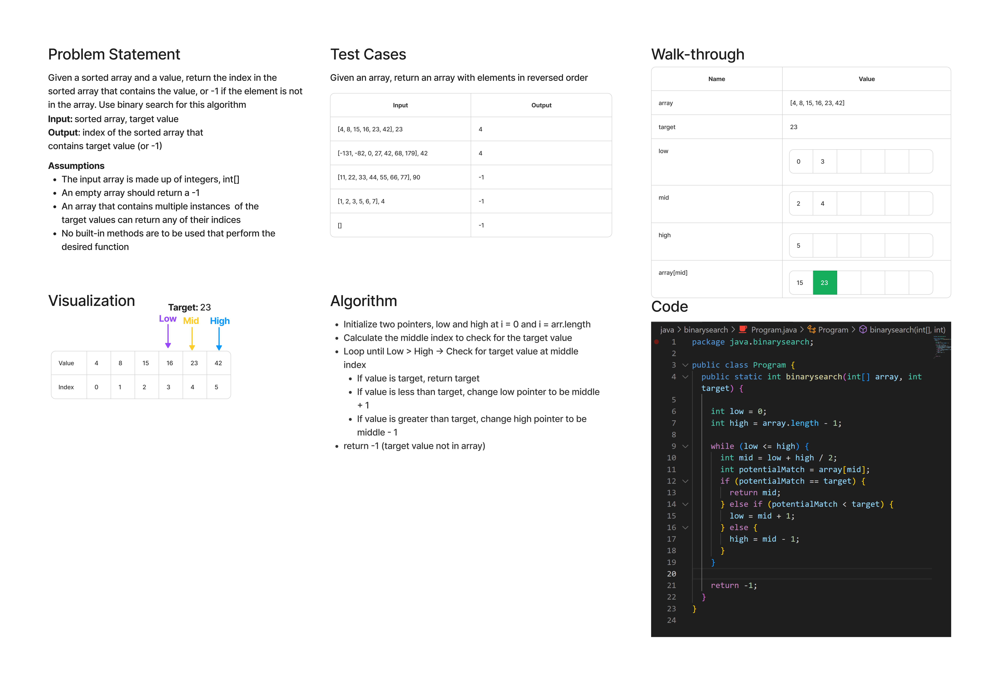

# Code Challenge: Class 3

Write a function called `BinarySearch` which takes in 2 parameters: a sorted array and the search key. Without utilizing any of the built-in methods available to your language, return the index of the array’s element that is equal to the value of the search key, or -1 if the element is not in the array.

## Whiteboard Process



## Approach & Efficiency

This solution uses the canonical binary search algorithm. We define two pointers and use them to calculate a middle index. We check the input array at that index to search for the target value. We then modify the appropriate pointer depending on the what we find, or return the index if we've found the target value.

With a divide and conquer approach, we're looking at a logarithmic time complexity, O(logn). Space complexity is O(1) because no additional space is needed.

## Solution

```Java
  public static int binarysearch(int[] array, int target) {

    int low = 0;
    int high = array.length - 1;

    while (low <= high) {
      int mid = low + high / 2;
      int potentialMatch = array[mid];
      if (potentialMatch == target) {
        return mid;
      } else if (potentialMatch < target) {
        low = mid + 1;
      } else {
        high = mid - 1;
      }
    }

    return -1;
  }
```
