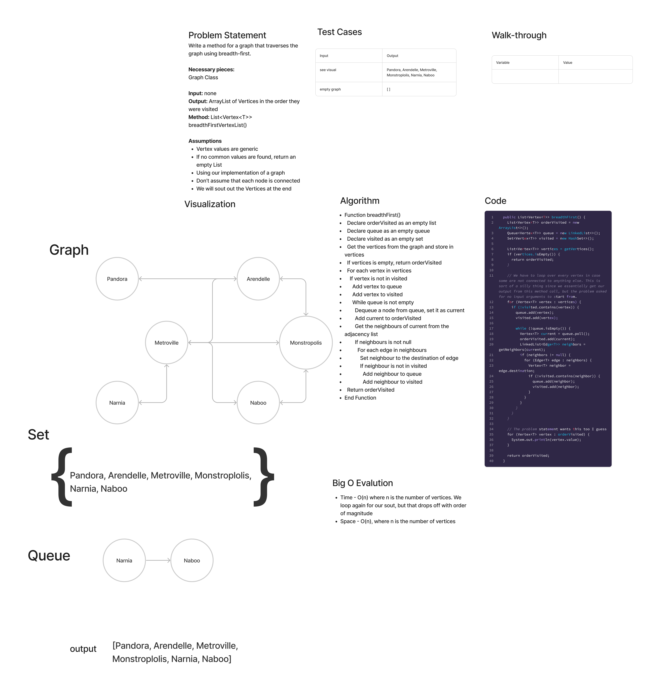

# Graph Breadth First

## Features

Write the following method for the Graph class:

- breadth first
  - Arguments: Node
  - Return: A collection of nodes in the order they were visited.
  - Display the collection

## Whiteboard Process

## Approach & Efficiency

We use a queue and a set to traverse each vertex, check if it's in a set, and then enqueue it if not. We check all the neighbors similarly after dequeueing. This is O(n) for time and space, since we check every vertex and store them in a list and set and queue, which all boils down to n when dropping off the multiples.

This is kind of a silly exercise when it's part of the graph class, and we aren't supposed to have an input.

## Solution

[Link to Graph Class](lib/src/main/java/datastructures/graph/Graph.java)

