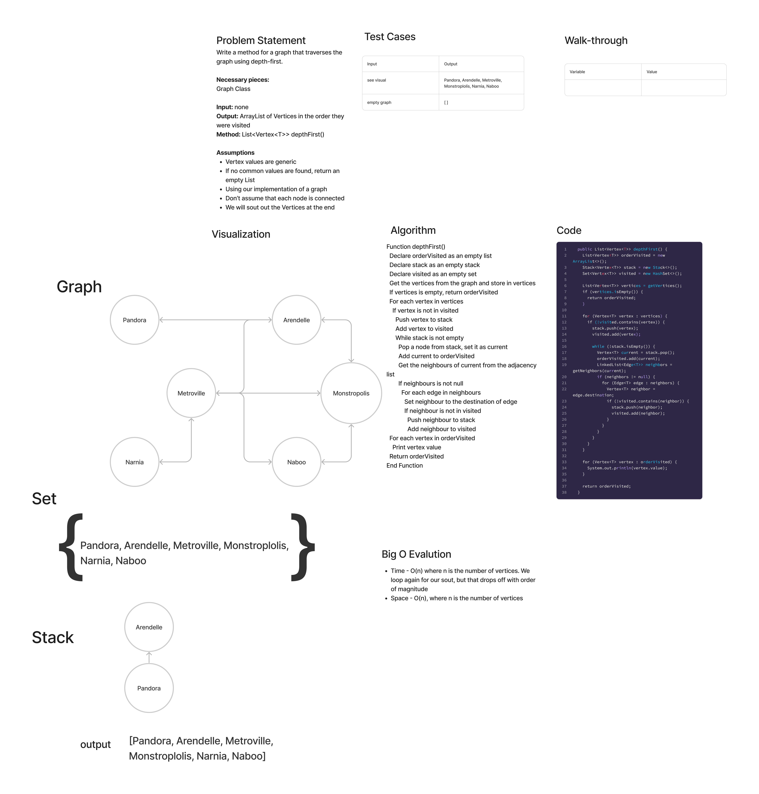

# Graph Depth First

## Features

Write the following method for the Graph class:

- depth first
  - Arguments: Node
  - Return: A collection of nodes in the order they were visited.
  - Display the collection

## Whiteboard Process

## Approach & Efficiency

In this implementation, the Queue has been replaced with a Stack, and the poll operation (which retrieves and removes the head of the queue) has been replaced with pop (which retrieves and removes the top of the stack). This ensures that we always continue from the deepest node that has unvisited neighbors - the essence of depth-first search.

## Solution

[Link to Graph Class](lib/src/main/java/datastructures/graph/Graph.java)

