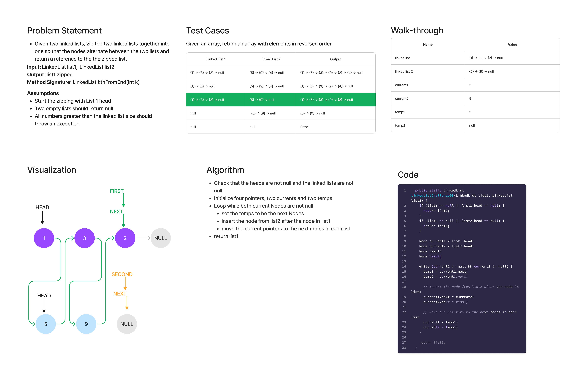

# Linked List Zip

## Features

Write the following method for the Linked List class:

- Write a function called zip lists
- Arguments: 2 linked lists
- Return: New Linked List, zipped as noted below
- Zip the two linked lists together into one so that the nodes alternate between the two lists and return a reference to the zipped list.
- Try and keep additional space down to O(1)
- You have access to the Node class and all the properties on the Linked List class as well as the methods created in previous challenges.

## Whiteboard Process

## Approach & Efficiency

This zipLists method first checks if either list is empty, and if so, it returns the other list. Then it iterates through both input lists simultaneously, connecting the nodes from the second list to the nodes in the first list in alternating order. This approach maintains the O(1) space complexity requirement as it only uses a few pointers to keep track of the current nodes in each list and does not create a new list object.

- kth from end
  - Time: O(n+m) -> O(n)
  - Space: O(1)

## Solution

[Link to LinkedList Class](lib/src/main/java/codechallenges/linkedlist/LinkedListChallenges.java)

[Link to LinkedList Tests](lib/src/test/java/codechallenges/linkedlist/LinkedListChallengesTest.java)
