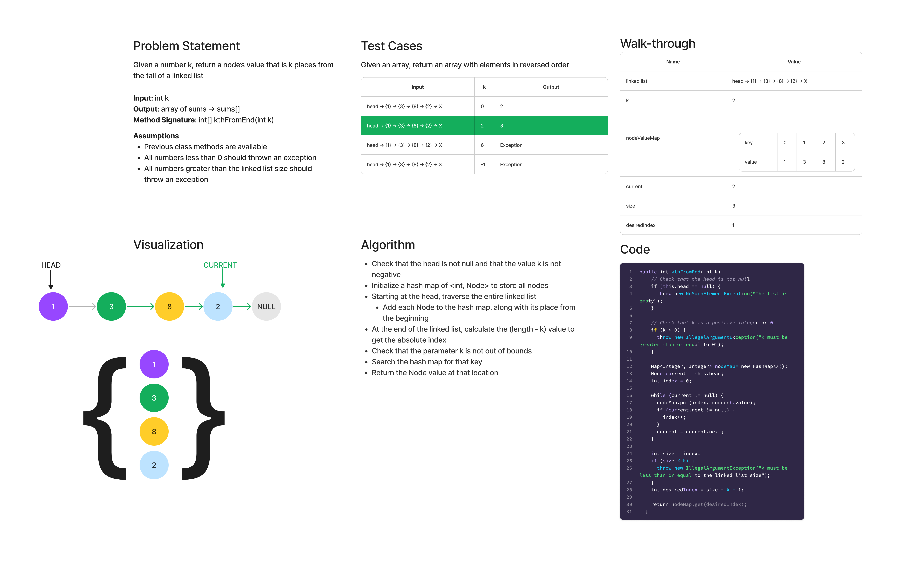

# Linked List Insertions

## Features

Write the following method for the Linked List class:

- kth from end
  - argument: a number, `k`, as a parameter.
  - Return the node’s value that is `k` places from the tail of the linked list.
  - You have access to the Node class and all the properties on the Linked List class as well as the methods created in previous challenges.

## Whiteboard Process

## Approach & Efficiency

The approach for this solution uses a Hash Map, which stores the position of the Node similar to an array index, as well as the Node itself. Once we traverse the linked list, we know implicitly whether the desired `k` is, and whether it can be returned.

- kth from end
  - Time: O(n) - We have to traverse to the end of the Linked List as a matter of course for this solution
  - Space: O(n) - Since we store every Node's value in a `HashMap`, we add `n` extra space

You could also use two pointers probably to have a more efficient space solution, but I ran out of self-enforced time.

## Solution

[Link to LinkedList Class](lib/src/main/java/datastructures/linkedlist/LinkedList.java)

[Link to LinkedList Tests](lib/src/test/java/datastructures/linkedlist/LinkedListTest.java)
