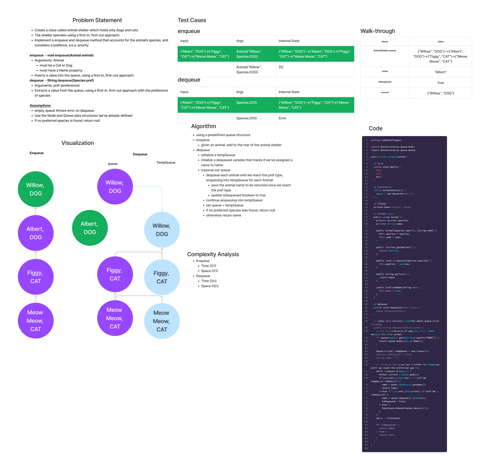

# Stacks and Queues Pseudo

## Features

### Stack

- Create a class called AnimalShelter which holds only dogs and cats.
- The shelter operates using a first-in, first-out approach.
- Implement the following methods:
  - enqueue
    - Arguments: animal
    - animal can be either a dog or a cat object.
    - It must have a species property that is either "cat" or "dog"
    - It must have a name property that is a string.
  - dequeue
    - Arguments: pref
    - pref can be either "dog" or "cat"
    - Return: either a dog or a cat, based on preference.
    - If pref is not "dog" or "cat" then return null.

**Stretch Goal**

If a cat or dog isn’t preferred, return whichever animal has been waiting in the shelter the longest.

## Whiteboard Process

## Approach & Efficiency

I used enums for the Species pref. In general, the approach is to use the built-in enqueue method from our implementation on Friday, and then for dequeue to use a second tempQueue to transfer the AnimalShelter queue into, saving our preferred animal if we find one, then returning its name.

- enqueue:
  - Time: O(1) - This is the same as a typical queue method
  - Space: O(1) - This is the same as a typical queue method

- dequeue:
  - Time: O(1) best case, O(n) worst case - It may be the first animal you find is a preferred type, otherwise you may have to traverse the entire queue to find one
  - Space: O(n) - This requires an additional queue of size n vs just one queue structure

## Solution

[Link to AnimalShelter Class](lib/src/main/java/codechallenges/AnimalShelter.java)

[Link to AnimalShelter Tests](lib/src/test/java/codechallenges/AnimalShelterTest.java)
