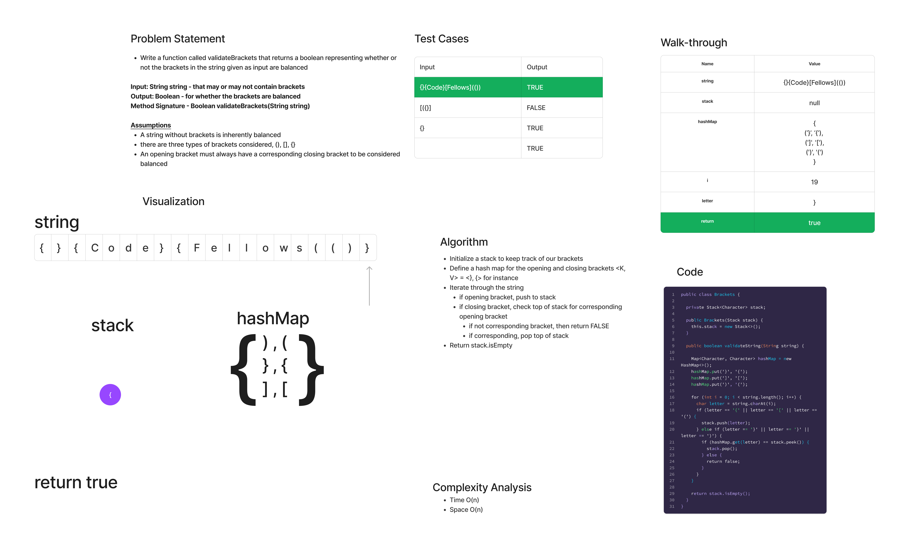

# Stacks and Queues Brackets

## Features

### Stack

- Write a function called validate brackets
  - Arguments: string
  - Return: boolean
    - representing whether or not the brackets in the string are balanced

There are 3 types of brackets:

- Round Brackets : ()
- Square Brackets : []
- Curly Brackets : {}

## Whiteboard Process

## Approach & Efficiency

The overall approach is to create a stack that pushes and pops corresponding opening brackets as we iterate over the string. We use a hashMap to store the key-value pairs of our three string types.

- Time: O(n)  - we always need to iterate over the entire string
- Space: O(n) - We create a stack that may be the entire length of the string

## Solution

[Link to PseudoQueue Class](lib/src/main/java/codechallenges/Brackets.java)

[Link to PseudoQueue Tests](lib/src/test/java/codechallenges/BracketsTest.java)
