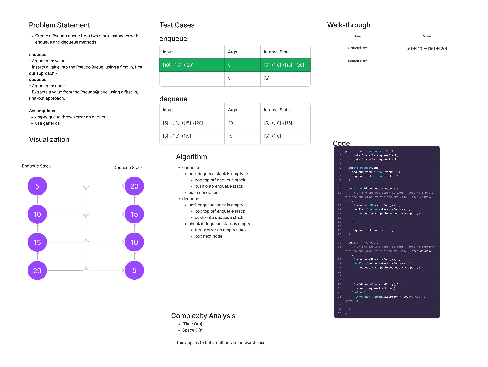

# Stacks and Queues Pseudo

## Features

### Stack

- Create a new class called pseudo queue.
  - Do not use an existing Queue.
  - Instead, this PseudoQueue class will implement our standard queue interface (the two methods listed below),
  - Internally, utilize 2 Stack instances to create and manage the queue
- Methods:
  - enqueue
    - Arguments: value
    - Inserts a value into the PseudoQueue, using a first-in, first-out approach.
  - dequeue
    - Arguments: none
    - Extracts a value from the PseudoQueue, using a first-in, first-out approach.

***NOTE**: The `Stack` instances have only `push`, `pop`, and `peek` methods. You should use your own Stack implementation. Instantiate these Stack objects in your PseudoQueue constructor.*

## Whiteboard Process

## Approach & Efficiency

- enqueue:
  - Time: O(1) best case, O(n) worst case - It may be that you have an empty enqueue stack and a full dequeue stack, i.e., dequeue was just called. We save the operation to swap the stacks for the next enqueue call, since someone may dequeue multiple times in a row
  - Space: O(n) - This requires an additional stack of size n vs just one queue structure

- dequeue:
  - Time: O(1) best case, O(n) worst case - It may be that you have an empty dequeue stack and a full enqueue stack, i.e., enqueue was just called. We save the operation to swap the stacks for the next dequeue call, since someone may enqueue multiple times in a row
  - Space: O(n) - This requires an additional stack of size n vs just one queue structure

## Solution

[Link to PseudoQueue Class](lib/src/main/java/codechallenges/PseudoQueue.java)

[Link to PseudoQueue Tests](lib/src/test/java/codechallenges/PseudoQueueTest.java)
