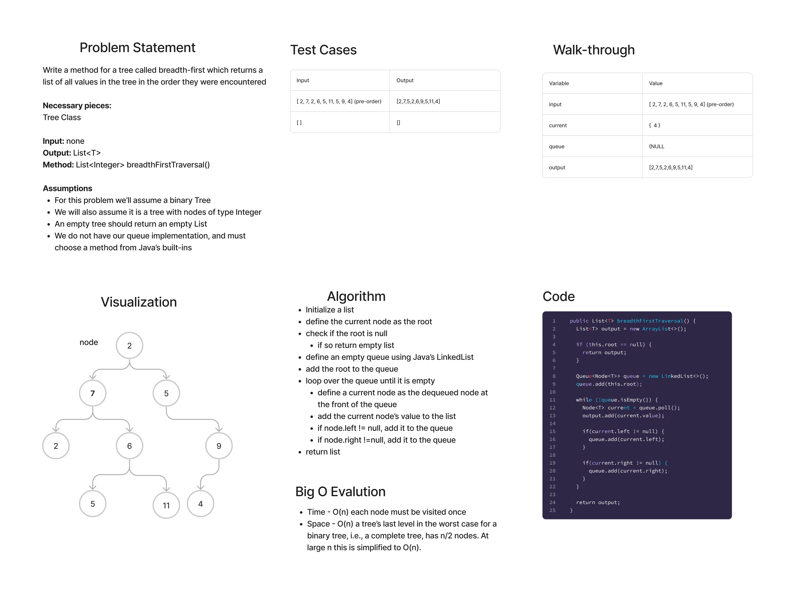

# Binary Tree Breadth-First

## Features

Write a function called breadth first

- Arguments: tree
- Return: list of all values in the tree, in the order they were encountered

## Whiteboard Process

## Approach & Efficiency

This method uses the breadth-first approach, obviously, which entails defining  queue structure and enqueuing and dequeuing each node at each level in order from left to right, then placing them into our output list.

- Time - O(n) each node must be visited once
- Space - O(n) a tree’s last level in the worst case for a binary tree, i.e., a complete tree, has n/2 nodes. At large n this is simplified to O(n).

## Solution

[Link to Binary Tree Class](lib/src/main/java/datastructures/trees/BinaryTree.java)

[Link to Binary Tree Test](lib/src/test/java/datastructures/trees/BinaryTreeTest.java)

