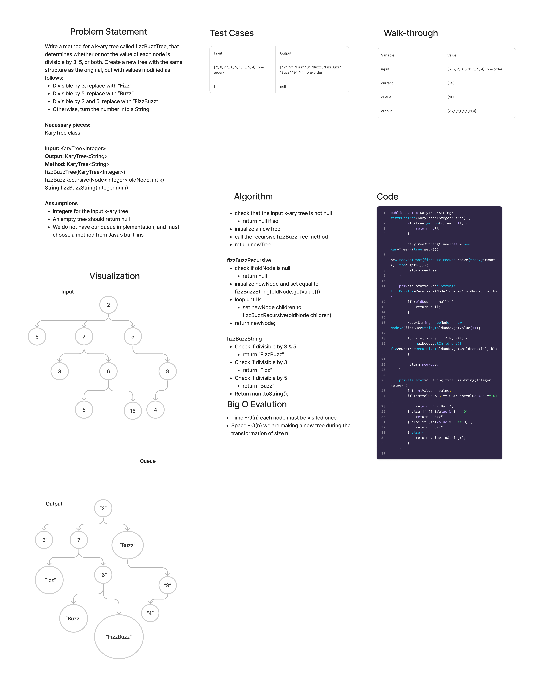

# Binary Tree getMax()

## Features

Write a function called fizz buzz tree

- Arguments: k-ary tree
- Return: new k-ary tree

Determine whether or not the value of each node is divisible by 3, 5 or both. Create a new tree with the same structure as the original, but the values modified as follows:

- If the value is divisible by 3, replace the value with “Fizz”
- If the value is divisible by 5, replace the value with “Buzz”
- If the value is divisible by 3 and 5, replace the value with “FizzBuzz”
- If the value is not divisible by 3 or 5, simply turn the number into a String.

## Whiteboard Process



## Approach & Efficiency

- The Big O time complexity for the traversals is O(n), as every node is visited exactly once. The space complexity is O(h), where h is the height of the tree, if the tree is well-ordered. Otherwise, it would be O(n).

## Solution

```
public static KaryTree<String> fizzBuzzTree(KaryTree<Integer> tree) {
        if (tree.getRoot() == null) {
            return null;
        }

        KaryTree<String> newTree = new KaryTree<>(tree.getK());
        newTree.setRoot(fizzBuzzTreeRecursive(tree.getRoot(), tree.getK()));
        return newTree;
    }

    private static Node<String> fizzBuzzTreeRecursive(Node<Integer> oldNode, int k) {
        if (oldNode == null) {
            return null;
        }

        Node<String> newNode = new Node<>(fizzBuzzString(oldNode.getValue()));

        for (int i = 0; i < k; i++) {
            newNode.getChildren()[i] = fizzBuzzTreeRecursive(oldNode.getChildren()[i], k);
        }

        return newNode;
    }

    private static String fizzBuzzString(Integer value) {
        int intValue = value;
        if (intValue % 3 == 0 && intValue % 5 == 0) {
            return "FizzBuzz";
        } else if (intValue % 3 == 0) {
            return "Fizz";
        } else if (intValue % 5 == 0) {
            return "Buzz";
        } else {
            return value.toString();
        }
    }
}
```


