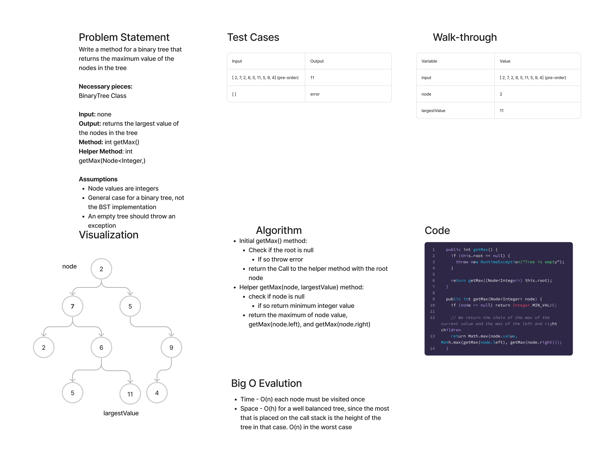

# Binary Tree getMax()

## Features

Write the following method for the Binary Tree class

- find maximum value
  - Arguments: none
  - Returns: number

Find the maximum value stored in the tree. You can assume that the values stored in the Binary Tree will be numeric.

## Whiteboard Process

## Approach & Efficiency

- The Big O time complexity for the traversals is O(n), as every node is visited exactly once. The space complexity is O(h), where h is the height of the tree, if the tree is well-ordered. Otherwise, it would be O(n).

## Solution

[Link to Binary Tree Class](lib/src/main/java/datastructures/trees/BinaryTree.java)

[Link to Binary Tree Test](lib/src/main/java/datastructures/trees/BinaryTreeTest.java)

