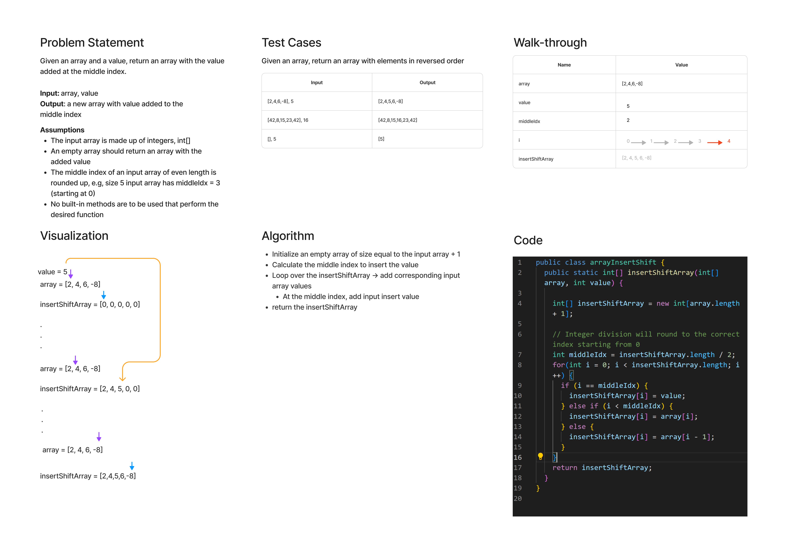

# Code Challenge: Class 1

Write a function called `insertShiftArray` which takes in an array and a value to be added. Without utilizing any of the built-in methods available to your language, return an array with the new value added at the middle index.

## Whiteboard Process



## Approach & Efficiency

The trickiest part of this problem is identifying the middle index. With integer division, you will always round down (the remainder is dropped). Therefore, using the size of the new array to divide in half always gets you the right middle index.

We traverse the new insertShiftArray with length of input array + 1, and using three conditionals determine if we are before, at, or after the middle index, assigning corresponding values based on the input array index or inserted value.

This is an O(n) time solution because it requires you to iterate once over an array with size n. This is also an O(n) space complexity solution, because the array is not mutated or modified in place, and thus a shiftInsertArray of size n + 1 is required. This + 1 is dropped at large values of n for complexity analysis, so O(n).

## Solution

```Java
public static int[] insertShiftArray(int[] array, int value) {

    int[] insertShiftArray = new int[array.length + 1];

    // Integer division will round to the correct index starting from 0
    int middleIdx = insertShiftArray.length / 2;
    for(int i = 0; i < insertShiftArray.length; i++) {
      if (i == middleIdx) {
        insertShiftArray[i] = value;
      } else if (i < middleIdx) {
        insertShiftArray[i] = array[i];
      } else {
        insertShiftArray[i] = array[i - 1];
      }
    }
    return insertShiftArray;
  }
```
