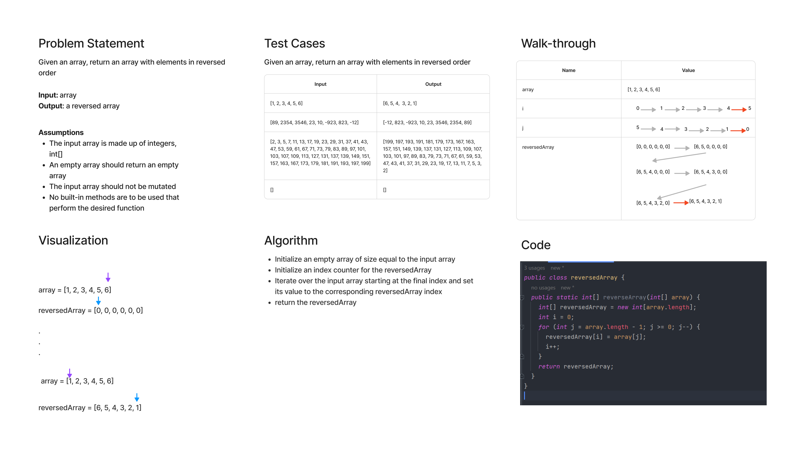

# Code Challenge: Class 1
Write a function called reverseArray which takes an array as an argument. Without utilizing any of the built-in methods available to your language, return an array with elements in reversed order.

## Whiteboard Process


## Approach & Efficiency
For this problem, I wanted a solution that required only one traversal of the input array. This seemed like the floor for how long you would need to reverse the array. To do this, we start with the final index and work backwards, setting the values to a reversedArray whose index starts from 0.

This is an O(n) time solution because it requires you to iterate once over an array with size n. This is also an O(n) space complexity solution, because the array is not mutated or modified in place, and thus a reversedArray of size n is required.

## Solution
Per the specifications to this first whiteboard challenge:

  **NOTE**: This challenge is **whiteboard only**
  - Write out code as part of your whiteboard process, but don’t worry about creating external program files.

I suppose I could've also just incremented one iterator and used math to find the appropriate input array index, i.e.,

```
 reversedArray[i] = arr[arr.length - 1 - i];
```

I already did all the whiteboarding though...
