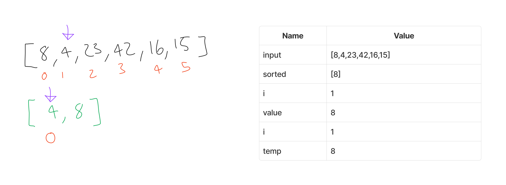
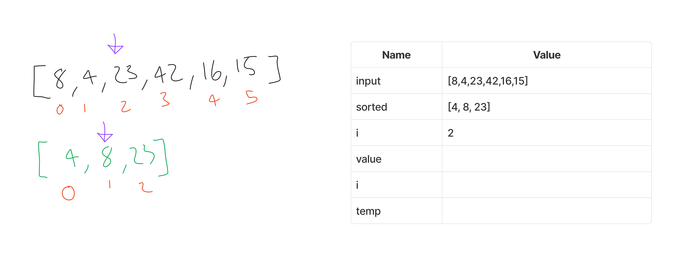
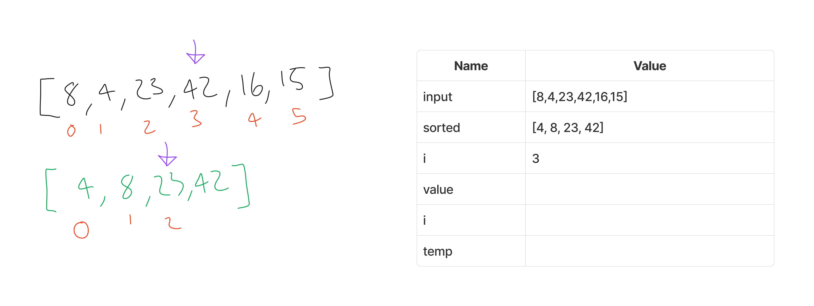
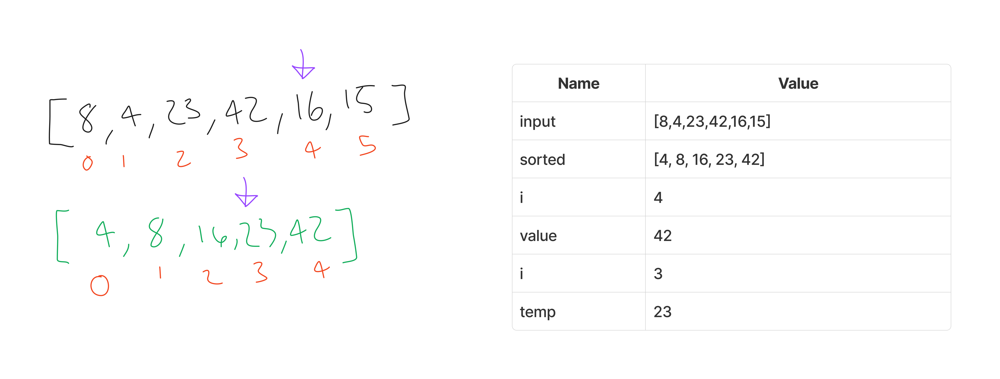
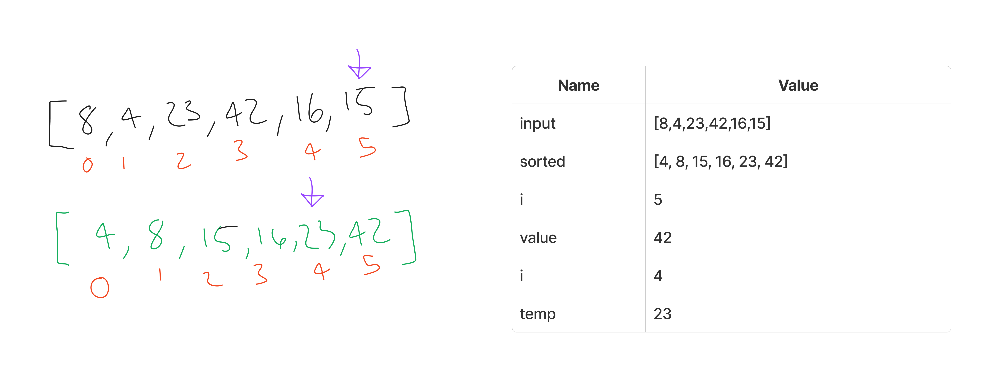

# Blog Notes: Insertion Sort

Insertion Sort is a simple sorting algorithm that builds the final sorted array one element at a time. It iterates over the input array and compares each element with the already sorted elements to find its correct position. It then shifts the larger elements to the right and inserts the current element at its appropriate place. This process continues until the entire array is sorted.

## Pseudocode

```pseudo
Insert(int[] sorted, int value)
  initialize i to 0
  WHILE value > sorted[i]
    set i to i + 1
  WHILE i < sorted.length
    set temp to sorted[i]
    set sorted[i] to value
    set value to temp
    set i to i + 1
  append value to sorted

InsertionSort(int[] input)
  LET sorted = New Empty Array
  sorted[0] = input[0]
  FOR i from 1 up to input.length
    Insert(sorted, input[i])
  return sorted
```

## Trace

Sample Array: `[8,4,23,42,16,15]`

### Pass 1



Start with an empty array called "sorted" and set its first element as the first element from the input array.

sorted = [8]

Then we call the `Insert` method starting from the second element of the input array, which is `4`. We pass in the current sorted array, along with the value to sort.

We initialize `i=0`, then iterate while `4` > every value in sorted and increment `i` until that is the case. In this pass that never happens, so we move to the next while loop. Inside that, while i < 1, we set `temp` to `8`, then put `4` where `8` was, then set `value` to `8`, then increment `i`. Afterwards we append `8` to `sorted`, leaving us with `[4, 8]`.

### Pass 2



sorted = [4, 8]

We repeat the process, incrementing `i=2`, then feeding in `23` to `Insert`. We iterate over `i`, but `23` is larger than anything in `sorted`, so we skip over the second `while` loop and simply append `23`

### Pass 3



sorted = [4, 8, 23]

This is similar to pass 3, our `Insert` method is called with `i = 3` of the `input` array, which is `42`. In our `Insert` method we increment `i` to the very end, as `42` is larger than any element in our `sorted` array. Then we append `42`.

### Pass 4



sorted = [4, 8, 23, 42]

We then increment `i = 4`, and call our `Insert` again with the value `16`. We increment `i` of `sorted` until we reach `i=2` (where `sorted[i] = 23`). Our condition is not met, and we move on to our second `while` loop.

We then loop for the entire length, setting `temp` to `23`, then setting the value that was `23` to `16`. We then set `value` to `23` and increment i. We repeat this process, overwriting `42` to `23`, but tracking `42` in our `value` variable. At the very end, once we've reached our array length, we append `42` to the end.

### Pass 5



sorted = [4, 8, 16, 23, 42]

For our final pass, we call `Insert` with `15`, the value at `i = 5` for our `input` array.

We then increment `i` until we reach `i = 2`, as `16` is greater than `15`. We repeat the process in step 4, storing `temp` values of the current index, overwriting them, then setting `value` to the `temp` value. Once we reach the end of the array, we append `42`. Finally, the `sorted = [4, 8 ,15, 16, 23, 42]` is returned in our `InsertionSort` method.

## Efficiency

- Time: O(n^2)

  - We have to iterate over the entire input array once, and for each index, at worst we have to iterate over the entire `sorted` array, in the case of a reverse sorted array.

- Space: O(n)

  - We store a separate array that is the same size as the input array.
