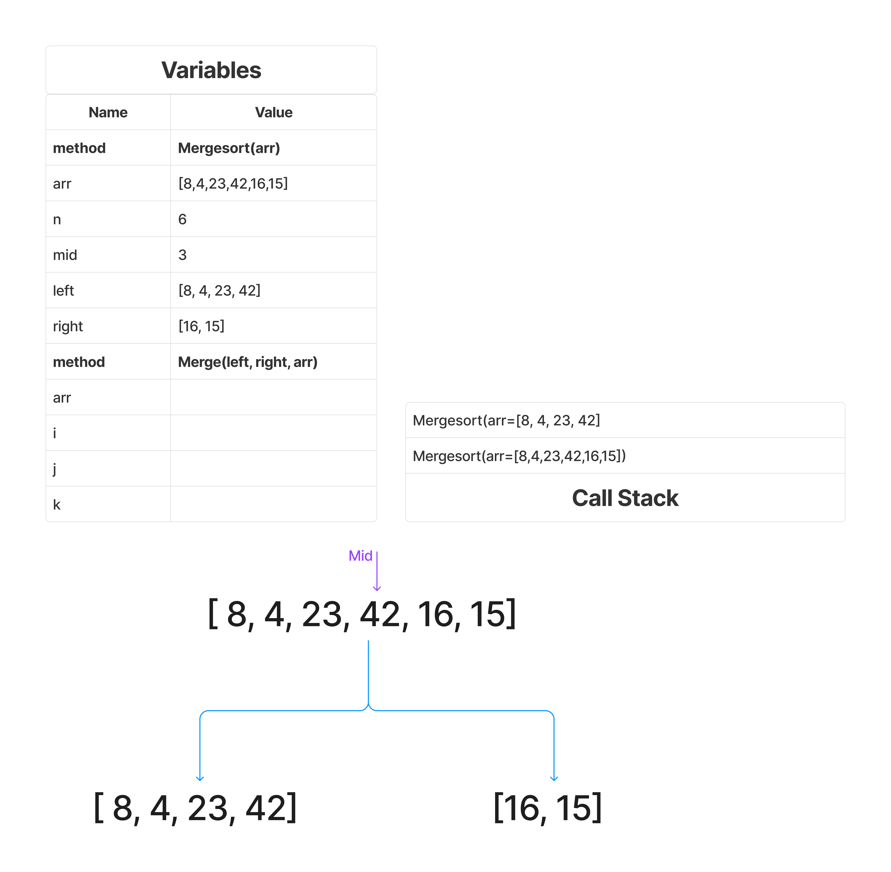
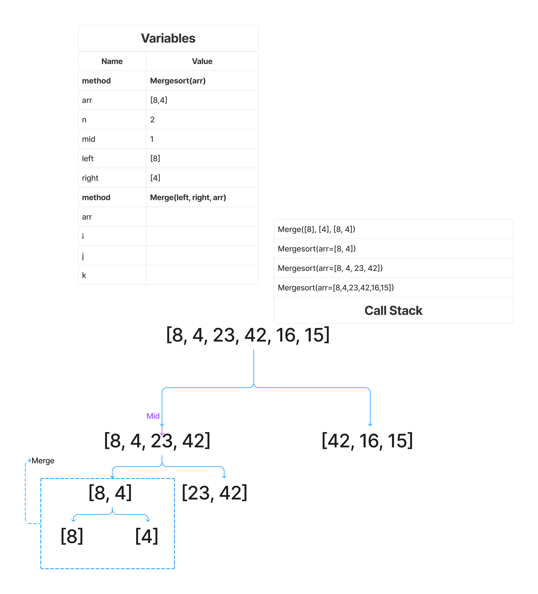
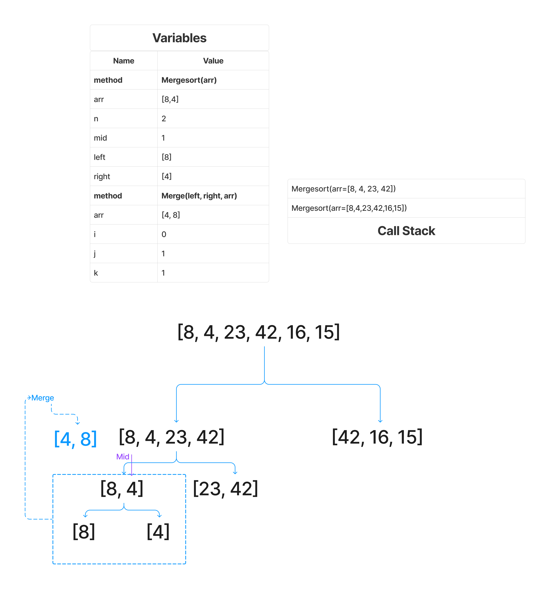
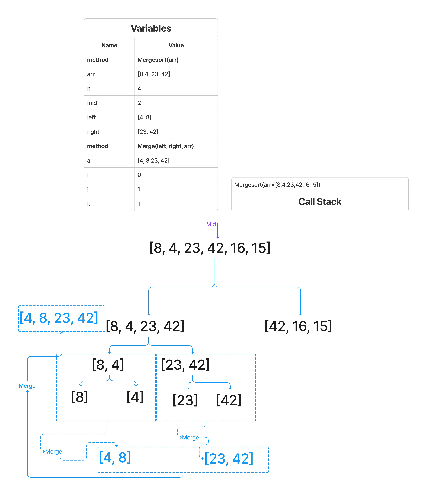

# Blog Notes: Merge Sort

The Merge Sort algorithm can be broken down into three distinct parts:

1. Divide: This step involves dividing the array into two halves until we have arrays that contain just one element each.
2. Sort: This step isn't explicitly performed, rather it's a result of the merging process where the smaller arrays get sorted automatically.
3. Merge: This step involves merging the sorted arrays into larger sorted arrays until we have a single sorted array.

## Pseudocode

```pseudo
ALGORITHM Mergesort(arr)
    DECLARE n <-- arr.length

    if n > 1
      DECLARE mid <-- n/2
      DECLARE left <-- arr[0...mid]
      DECLARE right <-- arr[mid...n]
      // sort the left side
      Mergesort(left)
      // sort the right side
      Mergesort(right)
      // merge the sorted left and right sides together
      Merge(left, right, arr)

ALGORITHM Merge(left, right, arr)
    DECLARE i <-- 0
    DECLARE j <-- 0
    DECLARE k <-- 0

    while i < left.length && j < right.length
        if left[i] <= right[j]
            arr[k] <-- left[i]
            i <-- i + 1
        else
            arr[k] <-- right[j]
            j <-- j + 1

        k <-- k + 1

    if i = left.length
       set remaining entries in arr to remaining values in right
    else
       set remaining entries in arr to remaining values in left
```

## Trace

Sample Array: `[8,4,23,42,16,15]`

### Pass 1



Start with our input array and declare `n` equal to its length, `6`. Then, we declare `mid` to be `3`, `left` to be `[8, 4, 23, 42]`, and `right` to be `[42, 16, 15]`. This is because we use integer division.

Next, we call `Mergesort`, passing in `left` to the function

This is added to the call stack, and this is what we'll call our first pass for now

### Pass 2



We repeat the process above, with `n=4=`, `mid = 2`, `left = [8, 4]`, and `right = [23, 42]`. We call Mergesort again passing in `left`. For brevity, we repeat this process once more so that finally we call `Mergesort` on `[8]`, whose left and right are the same. We then do not go into our conditional, because `n = 1`, and we return nothing. This is the same for our `right = [4]`, so now we can call `Merge`, passing in our `left = [8]`, and `right = [4]`, as well as `arr = [8, 4]`.

### Pass 3



Now we are in our Merge method, which has 3 pointers. We increment our pointers until we've traversed each subarray, setting the corresponding value of our `arr` at the correct index to be the sorted value. As an example, we start with `i = 0` and `j = 0`. We check that `left[0]` is less than or equal to `right[0]`, which is not the case. In our `else`, we set `arr[0] = right[0]`, or `arr[0] = 8`. We then increment `j` by `1`, and increment `k` by `1`.

Next, we check our `while` loop, and `j` is not less than the length of `right`. Moving on, `i` is not equal to `left.length`, so our `else` will set the remaining entries in `arr` to the remaining values in `left`, a.k.a., `8`, leaving us with `[4, 8]`. This call to `Merge` is popped off the call stack, as well as the call to `Mergesort`.

### Pass 4



For pass 4, we'll call this a repeat with the values [23, 42], which will be the opposite in our `Merge` call, since it is already sorted, we set `arr[0]` to be `left[0]` and increment `i`. Our second conditional outside of our `while` loop will set the rest of the values to the values of `right`.

Now, after popping those off the stack, we call `Merge` again, passing in `[4, 8]` as `left`, and `[23, 42]` as `right`, and finally `[8, 4, 23, 42]` as `arr`. In `Merge`, we start with the first pass of our `while` loop, which sets `arr[0] = left[0]`, or `4`. We increment `i` and `k` and go back around, next `8` is compared to `23`, and `arr[1] = 8`. Going back around, since `i = left.length`, break out of our while loop and set `arr[2] = 23`, and `arr[3] = 42`. We then pop `Merge` and `Mergesort` off the stack

### Pass 5

For brevity, we repeat the process with the right side, making several more calls to `Mergesort`, and a total of 3 calls to `Merge`, until we have `[15, 16, 42].

**IMPORTANT** Guess what this pseudocode is ass, and I knew from the beginning something was up, because divide and conquer using a mid pointer exlucdes mid in one of the two. Teach us explicitly that the convention shown here is exclusive of the final value when done in that manner, because I would've written it out as

```pseudo
arr[0...(mid - 1)]
arr[mid...(n - 1)]
```

So I've done the whole thing wrong up until this point. I'm not going back and fixing it.

## Efficiency

- Time: O(nlogn)

  - It's divide and conquer. Each division is capped at log base 2 of n.
  - We store every index in a separate array essentially, as each level of a binary tree involves a full scan through n elements during the merge step.
  - Multiplied together we get O(nlogn)

- Space: O(n)

  - This is because we have temp arrays of the left and right halves equal to every index of the original array
